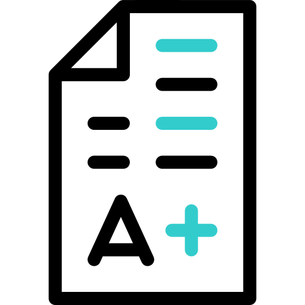

# 🎓 Online Exam - Mobile Application

<div align="center">
  
  
  [](https://flutter.dev/)
  [](https://dart.dev/)
  [](https://developer.android.com/)
  [](https://developer.apple.com/ios/)
  [](https://bloclibrary.dev/)
</div>

## 📱 نظرة عامة / Overview

**Online Exam** هو تطبيق Flutter متكامل لإدارة الامتحانات الإلكترونية يتيح للطلاب أداء امتحانات متعددة الاختيار مع تتبع النتائج وتحليل الأداء.

**Online Exam** is a comprehensive Flutter application for managing online exams that allows students to take multiple-choice exams while tracking results and analyzing performance.

## ✨ المميزات الرئيسية / Key Features

### 🎯 المميزات الأساسية / Core Features

- **🔐 المصادقة والتسجيل** - تسجيل دخول وتسجيل حساب جديد
- **📧 التحقق من البريد الإلكتروني** - التحقق من البريد الإلكتروني باستخدام رمز OTP
- **🔑 استعادة كلمة المرور** - استعادة كلمة المرور المنسية
- **📚 الاختبارات حسب المادة** - تصفح الاختبارات حسب المادة الدراسية
- **⏱️ مؤقت الامتحان** - امتحانات محددة بوقت مع مؤقت تنازلي
- **📝 امتحانات متعددة الاختيار** - أسئلة متعددة الاختيار مع واجهة سهلة الاستخدام
- **📊 تتبع النتائج** - عرض النتائج السابقة مع التحليل التفصيلي
- **💾 حفظ محلي** - حفظ تاريخ الامتحانات محلياً
- **👤 إدارة الملف الشخصي** - عرض وتعديل بيانات المستخدم
- **🌐 دعم متعدد اللغات** - دعم اللغة العربية والإنجليزية

### 🎯 Core Features

- **🔐 Authentication & Registration** - User login and account registration
- **📧 Email Verification** - Email verification using OTP code
- **🔑 Password Recovery** - Recover forgotten passwords
- **📚 Subject-Based Exams** - Browse exams by subject
- **⏱️ Exam Timer** - Time-limited exams with countdown timer
- **📝 Multiple Choice Questions** - MCQ with user-friendly interface
- **📊 Results Tracking** - View previous results with detailed analysis
- **💾 Local Storage** - Store exam history locally
- **👤 Profile Management** - View and edit user information
- **🌐 Multi-Language Support** - Support for Arabic and English

## 🛠️ التقنيات المستخدمة / Technologies Used

### Frontend Framework
- **Flutter** - Cross-platform mobile development framework
- **Dart** - Programming language
- **Material Design** - UI design system
- **Flutter ScreenUtil** - Screen size adaptation

### State Management
- **Flutter Bloc** - Predictable state management
- **Cubit** - Lightweight state management
- **BlocProvider** - Dependency injection for state

### Data Management
- **Hive** - Fast, lightweight key-value database for local storage
- **Dio** - Powerful HTTP client for API calls
- **Get It** - Service locator for dependency injection
- **Injectable** - Code generation for dependency injection
- **Retrofit** - Type-safe HTTP client

### Networking
- **Dio** - HTTP client with interceptors
- **Pretty Dio Logger** - Beautiful logging for network requests
- **Internet Connection Checker** - Network connectivity monitoring

### UI/UX Libraries
- **Cached Network Image** - Efficient image caching
- **Flutter SVG** - SVG rendering support
- **Lottie** - Beautiful animations
- **Skeletonizer** - Skeleton loading animations
- **Percent Indicator** - Progress indicators
- **Flutter Timer Countdown** - Countdown timer widget
- **Flutter OTP Text Field** - OTP input field
- **Expandable Page View** - Expandable page view for questions

### Additional Features
- **Shared Preferences** - Simple key-value storage
- **Flutter Localizations** - Internationalization support
- **JSON Serialization** - Automatic JSON encoding/decoding
- **Fluttertoast** - Toast notifications

### Development Tools
- **Build Runner** - Code generation
- **Flutter Lints** - Linting rules
- **Flutter Launcher Icons** - App icon generation
- **Flutter Native Splash** - Splash screen configuration

## 🏗️ Architecture

### Clean Architecture Pattern

The project follows **Clean Architecture** principles with clear separation of concerns:

```
lib/
├── core/                          # Core functionality
│   ├── classes/                   # Core classes
│   ├── di/                        # Dependency injection
│   ├── enums/                     # Enumerations
│   ├── errors/                    # Error handling
│   ├── functions/                 # Helper functions
│   ├── helpers/                   # Utility helpers
│   ├── l10n/                      # Localization
│   ├── network/                   # Network layer
│   ├── utils/                     # Utilities
│   └── widgets/                   # Reusable widgets
├── config/
│   ├── routing/                   # Navigation configuration
│   └── theme/                     # App theme
└── features/                      # Feature modules
    ├── auth/                      # Authentication feature
    │   ├── data/                  # Data layer
    │   │   ├── data_sources/     # Remote & local data sources
    │   │   ├── models/           # Data models
    │   │   └── repositories/     # Repository implementations
    │   ├── domain/                # Domain layer
    │   │   ├── entities/         # Business entities
    │   │   ├── repositories/     # Repository interfaces
    │   │   └── use_cases/        # Business logic
    │   └── presentation/          # Presentation layer
    │       ├── manager/          # BLoC/Cubit
    │       ├── pages/            # UI screens
    │       └── widgets/          # Feature widgets
    ├── Exam/                      # Exam feature
    ├── main_layout/               # Main layout with navigation
    │   ├── explore/              # Explore subjects
    │   ├── profile/              # User profile
    │   └── results/              # Exam results
    ├── subject_exams/             # Subject exams listing
    ├── specific_exam/             # Specific exam details
    └── splash/                    # Splash screen
└── main.dart                      # App entry point
```


### Architecture Layers

1. **Presentation Layer** - UI, widgets, and state management (BLoC/Cubit)
2. **Domain Layer** - Business logic, entities, and use cases
3. **Data Layer** - Data sources, models, and repository implementations

### Design Patterns

- **Repository Pattern** - Abstraction of data sources
- **BLoC Pattern** - State management
- **Dependency Injection** - Loose coupling and testability
- **Use Case Pattern** - Encapsulation of business logic

## 📦 التثبيت والتشغيل / Installation & Setup

### المتطلبات / Prerequisites

- Flutter SDK (>=3.8.1)
- Dart SDK
- Android Studio / VS Code with Flutter extensions
- Xcode (for iOS development)
- Git

### خطوات التثبيت / Installation Steps

1. **استنساخ المشروع / Clone the repository**
```bash
git clone https://github.com/yourusername/online-exam-mo.git
cd online-exam-mo
```

2. **التأكد من الفرع الصحيح / Check the correct branch**
```bash
git checkout development
```

3. **تثبيت التبعيات / Install dependencies**
```bash
flutter pub get
```

4. **تشغيل مولدات الكود / Run code generators**
```bash
flutter pub run build_runner build --delete-conflicting-outputs
```

5. **إعداد Splash Screen و Icons (اختياري) / Setup Splash Screen and Icons (Optional)**
```bash
# Generate app icons
flutter pub run flutter_launcher_icons

# Generate splash screen
flutter pub run flutter_native_splash:create
```

6. **تشغيل التطبيق / Run the app**
```bash
# Android
flutter run

# iOS
flutter run -d ios

# Specific device
flutter run -d <device_id>
```

## 🚀 المميزات التقنية / Technical Features

### Performance Optimizations
- **Image Caching** - Efficient image loading and caching
- **Local Storage** - Fast access to exam history
- **Lazy Loading** - Efficient data loading
- **Memory Management** - Optimized resource usage
- **Skeleton Loading** - Better perceived performance

### State Management
- **BLoC Pattern** - Predictable state changes
- **Cubit** - Lightweight state management
- **ValueNotifier** - Reactive updates

### User Experience
- **Responsive Design** - Works on all screen sizes
- **Smooth Animations** - Fluid transitions
- **Loading States** - User feedback
- **Error Handling** - Graceful error management
- **Toast Notifications** - User-friendly messages
- **Internationalization** - Multi-language support

### Data Persistence
- **Hive Database** - Fast local storage
- **Shared Preferences** - Simple key-value storage
- **Secure Storage** - Encrypted data storage

### Networking
- **REST API Integration** - API communication
- **Retrofit** - Type-safe API clients
- **Dio Interceptors** - Request/response handling
- **Error Handling** - Network error management
- **Internet Connectivity** - Network status monitoring

## 📱 المنصات المدعومة / Supported Platforms

- ✅ **Android** (API 21+)
- ✅ **iOS** (iOS 11+)
- 🔄 **Web** (Planning)
- 🔄 **Windows** (Planning)

## 🎨 Features Breakdown

### Authentication Module
- User registration with validation
- Secure login
- Email verification with OTP
- Password recovery
- Remember me functionality
- Token-based authentication

### Exam Module
- Subject-based exam browsing
- Exam details and instructions
- Timer-based exams
- Multiple choice questions
- Progress tracking
- Navigation between questions
- Final score calculation
- Result history

### Results Module
- View exam history
- Detailed score breakdown
- Correct/incorrect answers tracking
- Performance statistics

### Profile Module
- User information display
- Profile editing
- Password change
- Account management

## 🔧 Configuration

### Environment Setup

Configure your API endpoints in the network configuration:

```dart
// lib/core/network/api_constants.dart
class ApiConstants {
  static const String baseUrl = 'YOUR_API_BASE_URL';
  static const String apiKey = 'YOUR_API_KEY';
}
```

### Localization

Add translations in `lib/core/l10n/app_en.arb`:

```json
{
  "key": "value"
}
```

### Theme Configuration

Customize app theme in `lib/config/theme/app_theme.dart`

## 🤝 المساهمة / Contributing

نرحب بمساهماتكم! يرجى اتباع الخطوات التالية:

We welcome contributions! Please follow these steps:

1. Fork the project
2. Create your feature branch (`git checkout -b feature/AmazingFeature`)
3. Commit your changes (`git commit -m 'Add some AmazingFeature'`)
4. Push to the branch (`git push origin feature/AmazingFeature`)
5. Open a Pull Request

### Contribution Guidelines

- Follow Flutter best practices
- Write clean, maintainable code
- Add comments for complex logic
- Follow the existing code structure
- Write meaningful commit messages
- Test your changes thoroughly

## 📄 License

This project is licensed under the MIT License - see the [LICENSE](LICENSE) file for details.

## 👨‍💻 Developers

**Development Team**

- GitHub: [Your GitHub Profile]
- Email: your.email@example.com

## 🙏 Acknowledgments

- [Flutter Team](https://flutter.dev/) - For the amazing framework
- [BLoC Library](https://bloclibrary.dev/) - For Transparency & Simplicity
- [Hive](https://pub.dev/packages/hive) - For fast local storage
- [Retrofit](https://pub.dev/packages/retrofit) - For type-safe HTTP clients
- All contributors and open-source community

## 📞 Support

إذا واجهت أي مشاكل أو لديك أسئلة، يرجى فتح issue في GitHub.

If you encounter any issues or have questions, please open an issue on GitHub.

---

<div align="center">
  <p>صُنع بـ ❤️ باستخدام Flutter</p>
  <p>Made with ❤️ using Flutter</p>
</div>
